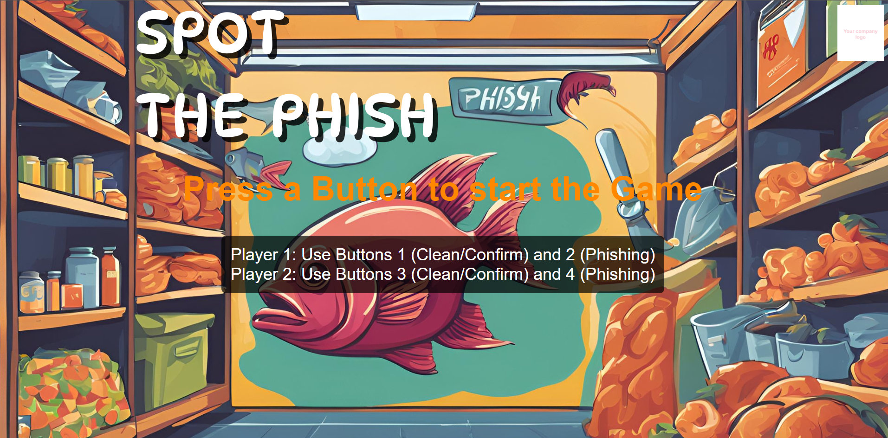
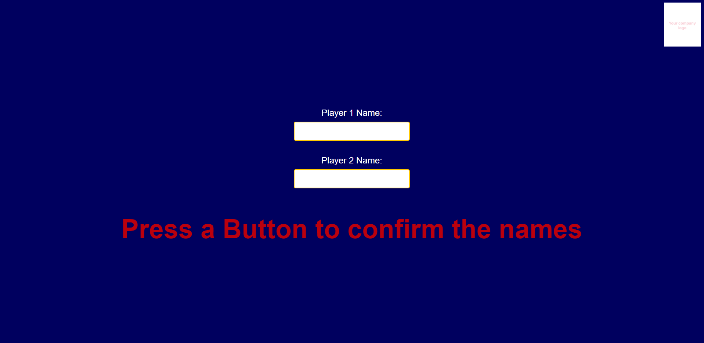
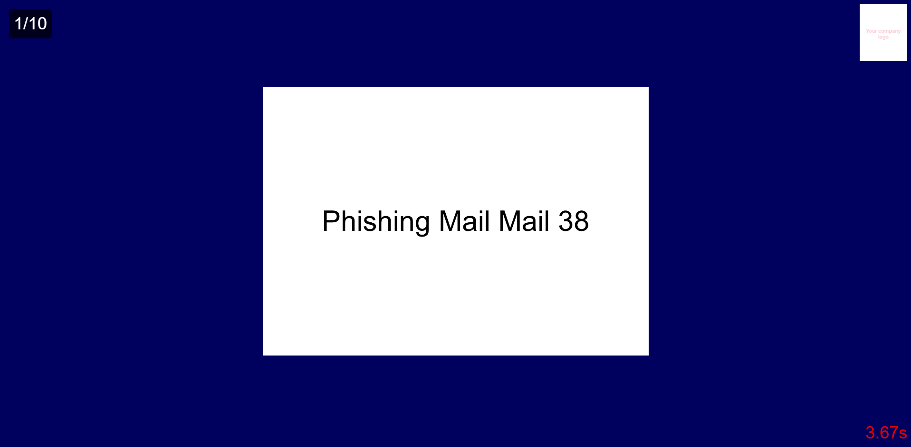
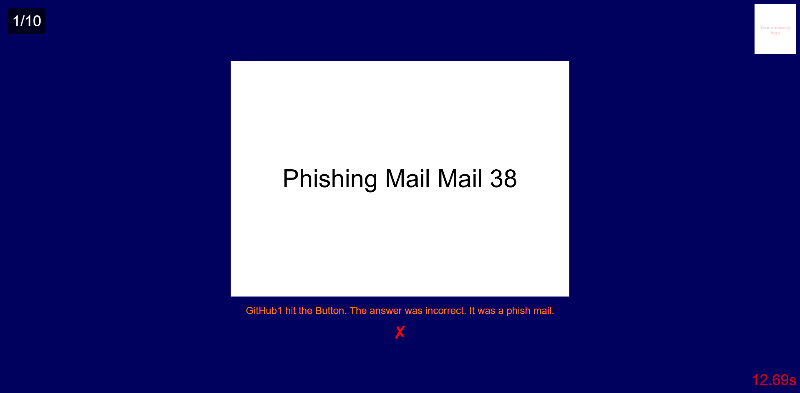
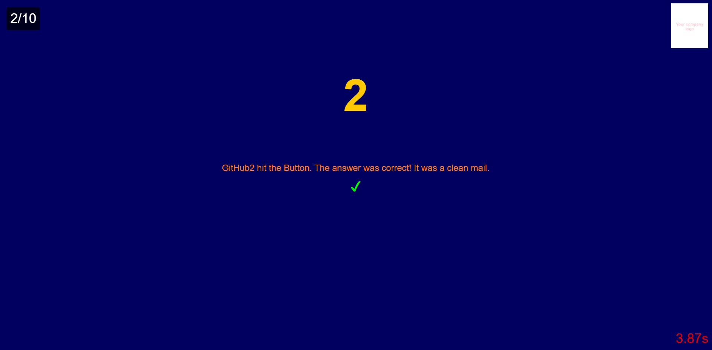
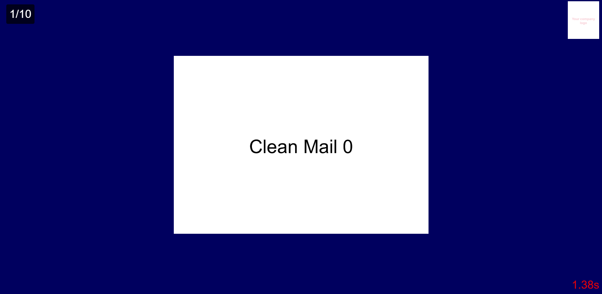
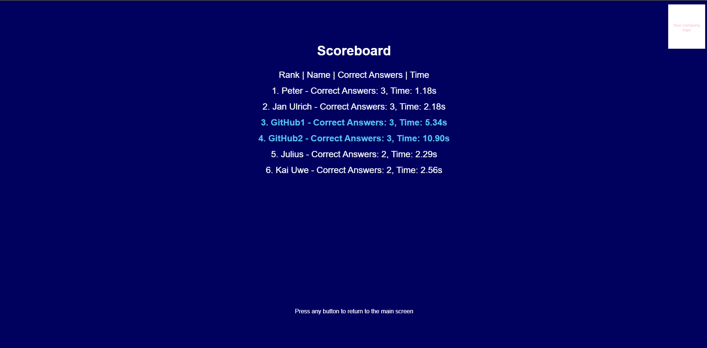

# Spot the Phish - Multiplayer Reaction Game

Welcome to **Spot the Phish**, a multiplayer reaction-based game where two players compete to identify phishing emails as quickly as possible. Players are presented with random email images, and they must hit the correct button to determine if the email is "Clean" or "Phishing." The player who reacts the fastest and with the highest accuracy will top the leaderboard!

## Project Overview

This project is a simple, fast-paced, two-player game built using **Express.js** on the server side and **vanilla JavaScript** on the client side. The game randomly presents images of emails, and each player must determine whether the email is legitimate or a phishing attempt. Player scores are tracked and stored in a scoreboard.

## Features

- **Multiplayer Game**: Two players can play at the same time, competing against each other.
- **Randomized Images**: Each game session presents a randomized set of email images for analysis.
- **Leaderboard**: Players' scores are saved and displayed on a scoreboard, ranked by correctness and speed.
- **Dynamic Feedback**: Instant feedback on whether the player’s guess was correct or incorrect.
- **Persistence**: Scores are saved to a JSON file on the server for future games.

## Installation

### Prerequisites

Make sure you have **Node.js** installed. You can download it from [here](https://nodejs.org/).

### Steps

1. Clone the repository:
   ```bash
   git clone https://github.com/JuliusTie/spot-the-phish-multiplayer-game.git
   cd spot-the-phish-multiplayer-game
   ```
2. Install dependencies:
   ```bash
   npm install
   ```
3. Run the server:
   ```bash
   node server.js
   ```
4. Open your browser and go to http://localhost:3000 to start the game.


## Improve the fun
For more fun, you can purchase programmable buzzers and change the button assignments. This makes the security awareness game a complete success.


## Screenshots







